## 概述
复杂写入功能通过支持指定列顺序、动态列头、合并单元格及自定义样式等特性，满足多样化的 Excel 数据导出需求。
## **根据参数只导出指定列**

### 概述
通过设置列名集合动态选择要导出的列，支持忽略列或仅导出特定列。

### excel 示例
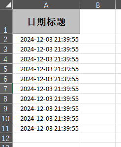

#### 代码示例
```java
@Test
public void excludeOrIncludeWrite() {
    String fileName = "excludeOrIncludeWrite" + System.currentTimeMillis() + ".xlsx";

    // 忽略指定列
    Set<String> excludeColumns = Set.of("date");
    FastExcel.write(fileName, DemoData.class)
        .excludeColumnFiledNames(excludeColumns)
        .sheet("模板")
        .doWrite(data());

    // 仅导出指定列
    Set<String> includeColumns = Set.of("date");
    FastExcel.write(fileName, DemoData.class)
        .includeColumnFiledNames(includeColumns)
        .sheet("模板")
        .doWrite(data());
}
```

## **指定写入的列顺序**

### 概述
通过 `@ExcelProperty` 注解的 `index` 属性指定列顺序。

### excel 示例
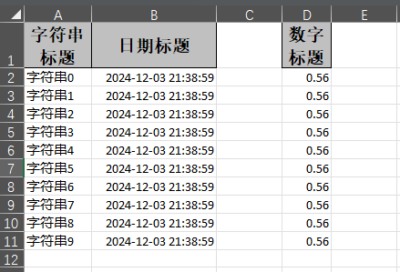

#### 示例对象
```java
@Getter
@Setter
@EqualsAndHashCode
public class IndexData {
    @ExcelProperty(value = "字符串标题", index = 0)
    private String string;
    @ExcelProperty(value = "日期标题", index = 1)
    private Date date;
    @ExcelProperty(value = "数字标题", index = 3)
    private Double doubleData; // 第二列留空
}
```

#### 代码示例
```java
@Test
public void indexWrite() {
    String fileName = "indexWrite" + System.currentTimeMillis() + ".xlsx";
    FastExcel.write(fileName, IndexData.class)
        .sheet("模板")
        .doWrite(data());
}
```


## **复杂头写入**

### 概述
支持设置多级表头，通过 `@ExcelProperty` 注解指定主标题和子标题。

### excel 示例
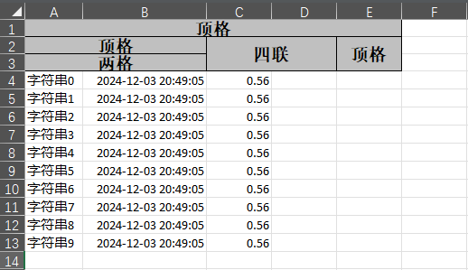

#### 示例对象
```java
@Getter
@Setter
@EqualsAndHashCode
public class ComplexHeadData {
    @ExcelProperty({"主标题", "字符串标题"})
    private String string;
    @ExcelProperty({"主标题", "日期标题"})
    private Date date;
    @ExcelProperty({"主标题", "数字标题"})
    private Double doubleData;
}
```

#### 代码示例
```java
@Test
public void complexHeadWrite() {
    String fileName = "complexHeadWrite" + System.currentTimeMillis() + ".xlsx";
    FastExcel.write(fileName, ComplexHeadData.class)
        .sheet("模板")
        .doWrite(data());
}
```


## **分批多次写入**

### 概述
分批写入数据到同一个 Sheet 或多个 Sheet，可实现大数据量的分页写入。

### excel 示例
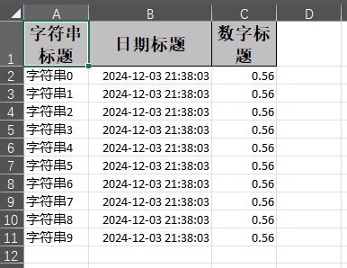

#### 代码示例
```java
@Test
public void repeatedWrite() {
    String fileName = "repeatedWrite" + System.currentTimeMillis() + ".xlsx";

    // 方法1：写入同一个 Sheet
    try (ExcelWriter excelWriter = FastExcel.write(fileName, DemoData.class).build()) {
        WriteSheet writeSheet = FastExcel.writerSheet("模板").build();
        for (int i = 0; i < 5; i++) {
            excelWriter.write(data(), writeSheet);
        }
    }

    // 方法2：写入多个 Sheet
    try (ExcelWriter excelWriter = FastExcel.write(fileName, DemoData.class).build()) {
        for (int i = 0; i < 5; i++) {
            WriteSheet writeSheet = FastExcel.writerSheet(i, "模板" + i).build();
            excelWriter.write(data(), writeSheet);
        }
    }
}
```


## **自定义格式写入**

### 概述
支持日期、数字或其他自定义格式，通过注解实现。

### excel 示例
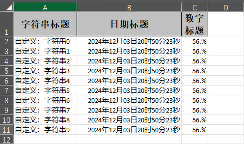

#### 示例对象
```java
@Getter
@Setter
@EqualsAndHashCode
public class ConverterData {
    @ExcelProperty(value = "字符串标题", converter = CustomStringStringConverter.class)
    private String string;

    @DateTimeFormat("yyyy年MM月dd日HH时mm分ss秒")
    @ExcelProperty("日期标题")
    private Date date;

    @NumberFormat("#.##%")
    @ExcelProperty("数字标题")
    private Double doubleData;
}
```

#### 代码示例
```java
@Test
public void converterWrite() {
    String fileName = "converterWrite" + System.currentTimeMillis() + ".xlsx";
    FastExcel.write(fileName, ConverterData.class)
        .sheet("模板")
        .doWrite(data());
}
```


## **自定义样式**

### 注解形式

#### 概述
通过实体类中的注解设置单元格样式，包括字体、背景颜色、行高等。

### excel 示例
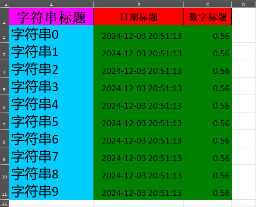

#### 示例对象
```java
@Getter
@Setter
@EqualsAndHashCode
// 设置头部背景为红色
@HeadStyle(fillPatternType = FillPatternTypeEnum.SOLID_FOREGROUND, fillForegroundColor = 10)
// 设置头部字体大小为20
@HeadFontStyle(fontHeightInPoints = 20)
// 设置内容背景为绿色
@ContentStyle(fillPatternType = FillPatternTypeEnum.SOLID_FOREGROUND, fillForegroundColor = 17)
// 设置内容字体大小为20
@ContentFontStyle(fontHeightInPoints = 20)
public class DemoStyleData {
    // 单独设置某列的头部和内容样式
    @HeadStyle(fillPatternType = FillPatternTypeEnum.SOLID_FOREGROUND, fillForegroundColor = 14)
    @HeadFontStyle(fontHeightInPoints = 30)
    @ContentStyle(fillPatternType = FillPatternTypeEnum.SOLID_FOREGROUND, fillForegroundColor = 40)
    @ContentFontStyle(fontHeightInPoints = 30)
    @ExcelProperty("字符串标题")
    private String string;

    @ExcelProperty("日期标题")
    private Date date;

    @ExcelProperty("数字标题")
    private Double doubleData;
}
```

#### 示例代码
```java
@Test
public void annotationStyleWrite() {
    String fileName = "annotationStyleWrite" + System.currentTimeMillis() + ".xlsx";

    FastExcel.write(fileName, DemoStyleData.class)
        .sheet("样式模板")
        .doWrite(data());
}
```


### **拦截器形式**

####  概述
通过实现拦截器接口 `WriteHandler` 动态设置样式，适用于复杂的样式逻辑。

### excel 示例
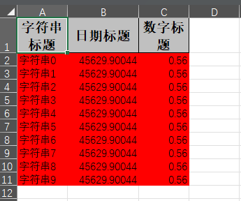

#### 示例 1：使用已有策略
通过 `HorizontalCellStyleStrategy` 为表头和内容分别设置样式。

#### 示例代码
```java
@Test
public void handlerStyleWrite() {
    String fileName = "handlerStyleWrite" + System.currentTimeMillis() + ".xlsx";

    // 定义表头样式
    WriteCellStyle headStyle = new WriteCellStyle();
    headStyle.setFillForegroundColor(IndexedColors.RED.getIndex()); // 红色背景
    WriteFont headFont = new WriteFont();
    headFont.setFontHeightInPoints((short) 20); // 字体大小为20
    headStyle.setWriteFont(headFont);

    // 定义内容样式
    WriteCellStyle contentStyle = new WriteCellStyle();
    contentStyle.setFillForegroundColor(IndexedColors.GREEN.getIndex()); // 绿色背景
    contentStyle.setFillPatternType(FillPatternType.SOLID_FOREGROUND);
    WriteFont contentFont = new WriteFont();
    contentFont.setFontHeightInPoints((short) 20);
    contentStyle.setWriteFont(contentFont);

    // 使用策略设置样式
    HorizontalCellStyleStrategy styleStrategy =
        new HorizontalCellStyleStrategy(headStyle, contentStyle);

    FastExcel.write(fileName, DemoData.class)
        .registerWriteHandler(styleStrategy)
        .sheet("样式模板")
        .doWrite(data());
}
```


#### 示例 2：完全自定义拦截器
如果已有策略无法满足需求，可以实现 `CellWriteHandler` 接口对样式进行完全自定义控制。

#### 自定义拦截器
```java
@Slf4j
public class CustomCellStyleWriteHandler implements CellWriteHandler {

    @Override
    public void afterCellDispose(CellWriteHandlerContext context) {
        // 仅设置内容单元格的样式
        if (BooleanUtils.isNotTrue(context.getHead())) {
            WriteCellData<?> cellData = context.getFirstCellData();
            WriteCellStyle writeCellStyle = cellData.getOrCreateStyle();

            // 设置背景颜色为黄色
            writeCellStyle.setFillForegroundColor(IndexedColors.YELLOW.getIndex());
            writeCellStyle.setFillPatternType(FillPatternType.SOLID_FOREGROUND);

            // 设置字体为蓝色
            WriteFont writeFont = new WriteFont();
            writeFont.setColor(IndexedColors.BLUE.getIndex());
            writeFont.setFontHeightInPoints((short) 14); // 字体大小为14
            writeCellStyle.setWriteFont(writeFont);

            log.info("已自定义单元格样式: 行 {}, 列 {}", context.getRowIndex(), context.getColumnIndex());
        }
    }
}
```

#### 示例代码
```java
@Test
public void customCellStyleWrite() {
    String fileName = "customCellStyleWrite" + System.currentTimeMillis() + ".xlsx";

    FastExcel.write(fileName, DemoData.class)
        .registerWriteHandler(new CustomCellStyleWriteHandler())
        .sheet("自定义样式")
        .doWrite(data());
}
```


#### 示例 3：结合 `POI` 样式自定义
直接操作 POI 的 `CellStyle`，适合对样式精确控制。

#### 示例代码
```java
@Test
public void poiStyleWrite() {
    String fileName = "poiStyleWrite" + System.currentTimeMillis() + ".xlsx";

    FastExcel.write(fileName, DemoData.class)
        .registerWriteHandler(new CellWriteHandler() {
            @Override
            public void afterCellDispose(CellWriteHandlerContext context) {
                if (BooleanUtils.isNotTrue(context.getHead())) {
                    Cell cell = context.getCell();
                    Workbook workbook = context.getWriteWorkbookHolder().getWorkbook();

                    // 创建并设置样式
                    CellStyle cellStyle = workbook.createCellStyle();
                    cellStyle.setFillForegroundColor(IndexedColors.LIGHT_ORANGE.getIndex());
                    cellStyle.setFillPattern(FillPatternType.SOLID_FOREGROUND);
                    cell.setCellStyle(cellStyle);
                }
            }
        })
        .sheet("POI样式")
        .doWrite(data());
}
```


### **应用场景说明**

| 场景                             | 建议使用方法                 | 示例            |
|----------------------------------|-----------------------------|-----------------|
| 简单样式设置                     | 注解形式                   | 示例 1          |
| 不同列或行动态设置样式            | 使用已有策略               | 示例 2-1        |
| 复杂条件控制样式                  | 自定义拦截器               | 示例 2-2        |
| 精确控制单元格样式                | POI 自定义                 | 示例 3          |


## **图片导出**

### 概述
支持通过文件、流、字节数组、URL 等多种方式导出图片。

### excel 示例
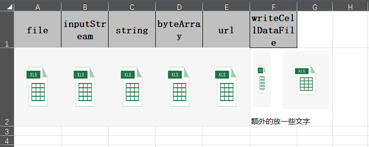

#### 示例对象
```java
@Getter
@Setter
@EqualsAndHashCode
@ContentRowHeight(100)
@ColumnWidth(25)
public class ImageDemoData {
    private File file;
    private InputStream inputStream;
    @ExcelProperty(converter = StringImageConverter.class)
    private String string;
    private byte[] byteArray;
    private URL url;
}
```

#### 代码示例
```java
@Test
public void imageWrite() throws Exception {
    String fileName = "imageWrite" + System.currentTimeMillis() + ".xlsx";
    String imagePath = "path/to/image.jpg";

    List<ImageDemoData> list = new ArrayList<>();
    ImageDemoData data = new ImageDemoData();
    data.setFile(new File(imagePath));
    data.setByteArray(Files.readAllBytes(Paths.get(imagePath)));
    data.setUrl(new URL("https://example.com/image.jpg"));
    list.add(data);

    FastExcel.write(fileName, ImageDemoData.class)
        .sheet()
        .doWrite(list);
}
```


## **超链接、备注、公式写入**

### 概述
支持单元格超链接、添加备注及设置公式内容。

### excel 示例
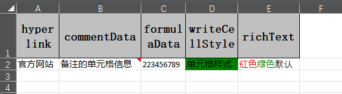

#### 示例对象
```java
@Getter
@Setter
@EqualsAndHashCode
public class WriteCellDemoData {
    private WriteCellData<String> hyperlink;
    private WriteCellData<String> commentData;
    private WriteCellData<String> formulaData;
}
```

#### 代码示例
```java
@Test
public void writeCellDataWrite() {
    String fileName = "writeCellDataWrite" + System.currentTimeMillis() + ".xlsx";
    WriteCellDemoData data = new WriteCellDemoData();

    // 设置超链接
    data.setHyperlink(new WriteCellData<>("点击访问").hyperlink("https://example.com"));

    // 设置备注
    data.setCommentData(new WriteCellData<>("备注信息"));

    // 设置公式
    data.setFormulaData(new WriteCellData<>("=SUM(A1:A10)"));

    FastExcel.write(fileName, WriteCellDemoData.class)
        .sheet("模板")
        .doWrite(Collections.singletonList(data));
}
```


## **动态头写入**

### 概述
实时生成表头，用于动态数据或国际化场景。

### excel 示例
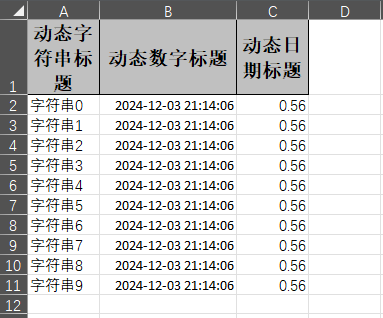

#### 代码示例
```java
@Test
public void dynamicHeadWrite() {
    String fileName = "dynamicHeadWrite" + System.currentTimeMillis() + ".xlsx";

    List<List<String>> head = Arrays.asList(
        Collections.singletonList("动态字符串标题"),
        Collections.singletonList("动态数字标题"),
        Collections.singletonList("动态日期标题")
    );

    FastExcel.write(fileName).head(head)
        .sheet("模板")
        .doWrite(data());
}
```


## **插入批注**

### 概述
通过拦截器在特定单元格添加批注，适用于标注说明或特殊提示。

### excel 示例
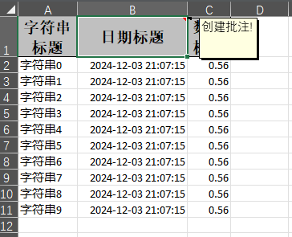

### 自定义批注拦截器
```java
@Slf4j
public class CommentWriteHandler implements RowWriteHandler {

    @Override
    public void afterRowDispose(RowWriteHandlerContext context) {
        if (BooleanUtils.isTrue(context.getHead())) {
            Sheet sheet = context.getWriteSheetHolder().getSheet();
            Drawing<?> drawingPatriarch = sheet.createDrawingPatriarch();
            // 在第一行第二列创建批注
            Comment comment = drawingPatriarch.createCellComment(
                new XSSFClientAnchor(0, 0, 0, 0, (short) 1, 0, (short) 2, 1));
            comment.setString(new XSSFRichTextString("批注内容"));
            sheet.getRow(0).getCell(1).setCellComment(comment);
        }
    }
}
```

### 示例代码
```java
@Test
public void commentWrite() {
    String fileName = "commentWrite" + System.currentTimeMillis() + ".xlsx";

    FastExcel.write(fileName, DemoData.class)
        .inMemory(Boolean.TRUE) // 批注必须启用内存模式
        .registerWriteHandler(new CommentWriteHandler())
        .sheet("批注示例")
        .doWrite(data());
}
```


## **根据模板写入**

### 概述
支持使用已有的模板文件，在模板上填充数据，适用于规范化输出。


### 示例代码
```java
@Test
public void templateWrite() {
    String templateFileName = "path/to/template.xlsx";
    String fileName = "templateWrite" + System.currentTimeMillis() + ".xlsx";

    FastExcel.write(fileName, DemoData.class)
        .withTemplate(templateFileName)
        .sheet()
        .doWrite(data());
}
```


## **列宽、行高**

### 概述
通过注解控制列宽、行高，适用于对表格格式有特定要求的场景。

### excel 示例
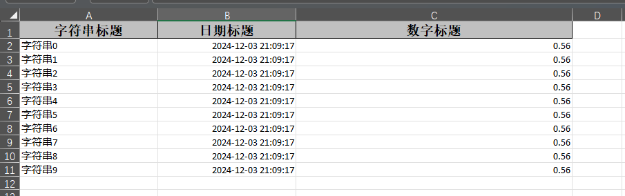

### 示例对象
```java
@Getter
@Setter
@EqualsAndHashCode
@ContentRowHeight(20)
@HeadRowHeight(30)
@ColumnWidth(25) // 默认列宽
public class WidthAndHeightData {
    @ExcelProperty("字符串标题")
    private String string;

    @ExcelProperty("日期标题")
    private Date date;

    @ColumnWidth(50) // 单独设置列宽
    @ExcelProperty("数字标题")
    private Double doubleData;
}
```

### 示例代码
```java
@Test
public void widthAndHeightWrite() {
    String fileName = "widthAndHeightWrite" + System.currentTimeMillis() + ".xlsx";

    FastExcel.write(fileName, WidthAndHeightData.class)
        .sheet("宽高示例")
        .doWrite(data());
}
```


## **合并单元格**

### 概述
支持通过注解或自定义合并策略实现合并单元格。

### excel 示例
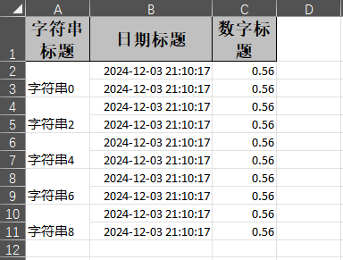

### 方法 1：注解形式
```java
@Getter
@Setter
@EqualsAndHashCode
public class DemoMergeData {
    @ContentLoopMerge(eachRow = 2) // 每隔 2 行合并一次
    @ExcelProperty("字符串标题")
    private String string;

    @ExcelProperty("日期标题")
    private Date date;

    @ExcelProperty("数字标题")
    private Double doubleData;
}
```

### 方法 2：自定义合并策略
```java
public class CustomMergeStrategy extends AbstractMergeStrategy {
    @Override
    protected void merge(Sheet sheet, WriteSheetHolder writeSheetHolder) {
        // 自定义合并规则
        sheet.addMergedRegion(new CellRangeAddress(1, 2, 0, 1)); // 示例合并范围
    }
}
```

### 示例代码
```java
@Test
public void mergeWrite() {
    String fileName = "mergeWrite" + System.currentTimeMillis() + ".xlsx";

    // 注解方式
    FastExcel.write(fileName, DemoMergeData.class)
        .sheet("合并示例")
        .doWrite(data());

    // 自定义合并策略
    FastExcel.write(fileName, DemoData.class)
        .registerWriteHandler(new CustomMergeStrategy())
        .sheet("自定义合并")
        .doWrite(data());
}
```


## **使用 Table 写入**

### 概述
支持在一个 Sheet 中使用多个 Table 分块写入。

### excel 示例
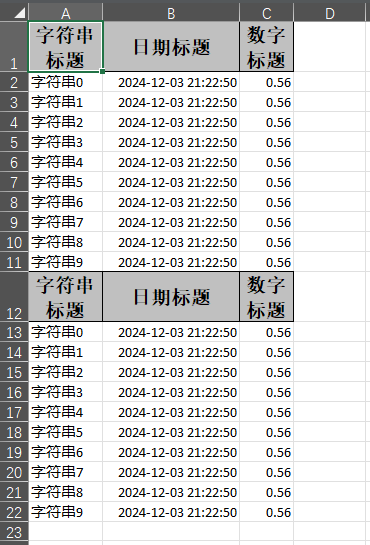

### 示例代码
```java
@Test
public void tableWrite() {
    String fileName = "tableWrite" + System.currentTimeMillis() + ".xlsx";

    try (ExcelWriter excelWriter = FastExcel.write(fileName, DemoData.class).build()) {
        WriteSheet writeSheet = FastExcel.writerSheet("Table示例").build();
        WriteTable table1 = FastExcel.writerTable(0).build();
        WriteTable table2 = FastExcel.writerTable(1).build();

        excelWriter.write(data(), writeSheet, table1);
        excelWriter.write(data(), writeSheet, table2);
    }
}
```


## **动态头写入**

### 概述
实时生成动态表头，适用于表头内容动态变化的场景。

### excel 示例


### 示例代码
```java
@Test
public void dynamicHeadWrite() {
    String fileName = "dynamicHeadWrite" + System.currentTimeMillis() + ".xlsx";

    List<List<String>> head = Arrays.asList(
        Collections.singletonList("动态字符串标题"),
        Collections.singletonList("动态数字标题"),
        Collections.singletonList("动态日期标题"));

    FastExcel.write(fileName)
        .head(head)
        .sheet("动态头")
        .doWrite(data());
}
```


## **自定义拦截器**

### 概述
实现自定义逻辑（如添加下拉框、设置超链接）需要通过拦截器操作。

### excel 示例
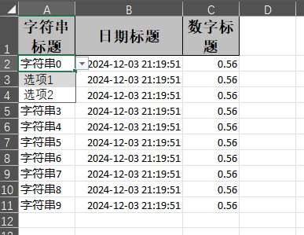

### 示例 1：设置下拉框
```java
public class DropdownWriteHandler implements SheetWriteHandler {
    @Override
    public void afterSheetCreate(SheetWriteHandlerContext context) {
        DataValidationHelper helper = context.getWriteSheetHolder().getSheet().getDataValidationHelper();
        CellRangeAddressList range = new CellRangeAddressList(1, 10, 0, 0); // 下拉框区域
        DataValidationConstraint constraint = helper.createExplicitListConstraint(new String[] {"选项1", "选项2"});
        DataValidation validation = helper.createValidation(constraint, range);
        context.getWriteSheetHolder().getSheet().addValidationData(validation);
    }
}
```

### 示例代码
```java
@Test
public void customHandlerWrite() {
    String fileName = "customHandlerWrite" + System.currentTimeMillis() + ".xlsx";

    FastExcel.write(fileName, DemoData.class)
        .registerWriteHandler(new DropdownWriteHandler())
        .sheet("自定义拦截器")
        .doWrite(data());
}
```


## **不创建对象的写入**

### 概述
直接使用 `List<List<String>>` 定义头和数据写入，无需创建实体类。

### excel 示例
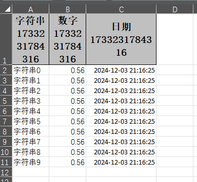

### 示例代码
```java
@Test
public void noModelWrite() {
    String fileName = "noModelWrite" + System.currentTimeMillis() + ".xlsx";

    FastExcel.write(fileName)
        .head(head()) // 动态头
        .sheet("无对象写入")
        .doWrite(dataList());
}

private List<List<String>> head() {
    return Arrays.asList(
        Collections.singletonList("字符串标题"),
        Collections.singletonList("数字标题"),
        Collections.singletonList("日期标题"));
}

private List<List<Object>> dataList() {
    List<List<Object>> list = new ArrayList<>();
    for (int i = 0; i < 10; i++) {
        list.add(Arrays.asList("字符串" + i, 0.56, new Date()));
    }
    return list;
}
```

## **Excel数据验证功能**

### 概述
FastExcel 提供了强大的数据验证功能，通过验证注解和处理器，可以在Excel模板中生成各种数据验证规则，确保数据输入的准确性和一致性。

### 支持的验证类型
- **下拉选择验证** - 限制用户只能从预定义选项中选择
- **数值范围验证** - 控制数值输入范围和精度
- **日期范围验证** - 限制日期输入格式和范围
- **必填字段验证** - 标记和验证必填项
- **自动序号生成** - 写入时自动生成递增ID
- **默认值设置** - 预设默认值并可锁定单元格

### 示例对象
```java
@Data
public class ProjectValidationData {
    @ExcelProperty("序号")
    @AutoIncrementId(start = 1)
    private Integer id;

    @ExcelProperty("项目名称")
    @ExcelRequired(message = "项目名称不能为空")
    private String projectName;

    @ExcelProperty("项目类型")
    @ExcelSelect({"基础设施", "房屋建筑", "市政工程", "水利工程", "其他"})
    @ExcelRequired(message = "请选择项目类型")
    private String projectType;

    @ExcelProperty("项目金额(万元)")
    @ExcelNumberValidation(
        min = 0.0,
        max = 999999.99,
        decimalPlaces = 2,
        errorTitle = "金额输入错误",
        errorContent = "请输入0到999999.99之间的金额，最多2位小数",
        unit = "万元"
    )
    @ExcelRequired(message = "项目金额不能为空")
    private BigDecimal projectAmount;

    @ExcelProperty("项目进度(%)")
    @ExcelNumberValidation(
        min = 0.0,
        max = 100.0,
        decimalPlaces = 1,
        unit = "%"
    )
    private BigDecimal progress;

    @ExcelProperty("开始日期")
    @ExcelDateValidation(
        format = "yyyy-MM-dd",
        minDate = "2020-01-01",
        maxDate = "2030-12-31",
        errorTitle = "日期输入错误",
        errorContent = "请输入2020-01-01到2030-12-31之间的日期"
    )
    @ExcelRequired(message = "开始日期不能为空")
    private Date startDate;

    @ExcelProperty("结束日期")
    @ExcelDateValidation(
        format = "yyyy-MM-dd",
        minDate = "2020-01-01",
        maxDate = "2030-12-31"
    )
    private Date endDate;

    @ExcelProperty("负责部门")
    @ExcelDefaultValue(value = "工程部")
    private String department;

    @ExcelProperty("备注")
    private String remark;
}
```

### 写入带验证的Excel模板
```java
@Test
public void writeValidationTemplate() {
    String fileName = "validation_template.xlsx";

    // 创建测试数据
    List<ProjectValidationData> dataList = createTestData();

    // 写入Excel，注册所有验证处理器
    EasyExcel.write(fileName, ProjectValidationData.class)
        .registerWriteHandler(new ExcelSelectHandler(ProjectValidationData.class))
        .registerWriteHandler(new ExcelNumberValidationHandler(ProjectValidationData.class))
        .registerWriteHandler(new ExcelDateValidationHandler(ProjectValidationData.class))
        .registerWriteHandler(new ExcelDefaultValueHandler(ProjectValidationData.class))
        .registerWriteHandler(new AutoIncrementIdHandler())
        .sheet("项目信息模板")
        .doWrite(dataList);
}

private List<ProjectValidationData> createTestData() {
    List<ProjectValidationData> dataList = new ArrayList<>();

    for (int i = 1; i <= 3; i++) {
        ProjectValidationData data = new ProjectValidationData();
        data.setProjectName("示例项目" + i);
        data.setProjectType("基础设施");
        data.setProjectAmount(new BigDecimal("100.50"));
        data.setProgress(new BigDecimal("50.5"));
        data.setStartDate(new Date());
        data.setRemark("这是示例项目" + i + "的备注");

        dataList.add(data);
    }

    return dataList;
}
```

### 读取并验证数据
```java
@Test
public void readAndValidateData() {
    String fileName = "validation_data.xlsx";

    // 读取Excel数据
    List<ProjectValidationData> dataList = EasyExcel.read(fileName)
        .head(ProjectValidationData.class)
        .sheet()
        .doReadSync();

    // 验证必填字段
    List<ExcelValidationUtils.ValidationResult> results =
        ExcelValidationUtils.validateRequiredBatch(dataList);

    // 处理验证结果
    if (results.isEmpty()) {
        System.out.println("所有数据验证通过");
    } else {
        System.out.println("发现验证失败的数据:");
        for (ExcelValidationUtils.ValidationResult result : results) {
            System.out.println("第" + (result.getRowIndex() + 1) + "行: " +
                             String.join(", ", result.getErrors()));
        }
    }
}
```

### 验证功能特性

#### 1. 下拉选择验证
- 在Excel中生成下拉选择框
- 限制用户只能从预定义选项中选择
- 支持自定义错误提示信息

#### 2. 数值验证
- 控制数值输入的最小值和最大值
- 限制小数位数
- 支持占位符错误消息（{min}、{max}、{decimal}、{unit}）
- 支持输入提示框

#### 3. 日期验证
- 限制日期输入格式
- 控制日期输入范围
- 支持占位符错误消息（{format}、{minDate}、{maxDate}）

#### 4. 必填字段验证
- 标记必填字段
- 读取时自动验证
- 生成详细的验证错误报告

#### 5. 自动序号
- 写入时自动生成递增序号
- 支持自定义起始值

#### 6. 默认值设置
- 为字段设置默认值
- 支持设置生效的行范围

### 注意事项
1. 验证处理器需要在写入时注册才能生效
2. 必填字段验证在读取数据后使用 `ExcelValidationUtils` 进行
3. 验证规则仅在Excel应用程序中生效，不影响程序读取


